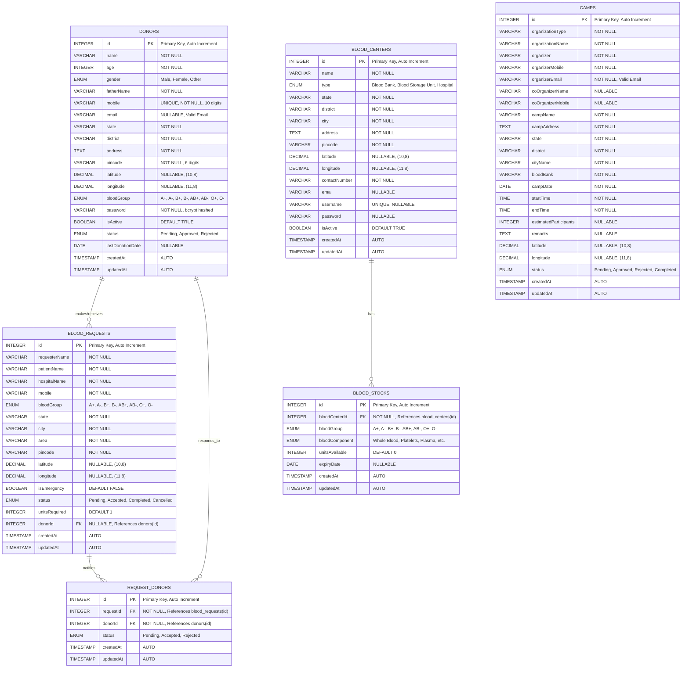

# LifeLink - Entity Relationship Diagram (ERD)

## Database Schema with Primary Keys and Relationships

---

## ER Diagram (Mermaid Format)



---

## Detailed Entity Descriptions

### 1. DONORS (Main User Table)
**Purpose:** Stores information about registered blood donors

**Primary Key:** `id` (INTEGER, AUTO_INCREMENT)

**Unique Constraints:** `mobile`

**Key Attributes:**
- **Authentication:** `mobile`, `password` (bcrypt hashed)
- **Personal Info:** `name`, `age`, `gender`, `fatherName`
- **Contact:** `mobile` (10 digits), `email`
- **Location:** `state`, `district`, `address`, `pincode`, `latitude`, `longitude`
- **Medical:** `bloodGroup` (A+, A-, B+, B-, AB+, AB-, O+, O-)
- **Status:** `isActive` (eligibility), `status` (Pending/Approved/Rejected)
- **Donation History:** `lastDonationDate`

**Indexes:**
- PRIMARY KEY on `id`
- UNIQUE INDEX on `mobile`
- INDEX on `bloodGroup`
- INDEX on `status`
- INDEX on `isActive`
- GIST INDEX on (`latitude`, `longitude`) for geospatial queries

---

### 2. BLOOD_REQUESTS (Blood Request Table)
**Purpose:** Stores blood requirement requests from patients/hospitals

**Primary Key:** `id` (INTEGER, AUTO_INCREMENT)

**Foreign Keys:** 
- `donorId` → `donors(id)` (NULLABLE - assigned when donor accepts)

**Key Attributes:**
- **Requester Info:** `requesterName`, `mobile`
- **Patient Info:** `patientName`, `hospitalName`
- **Blood Details:** `bloodGroup`, `unitsRequired`
- **Location:** `state`, `city`, `area`, `pincode`, `latitude`, `longitude`
- **Priority:** `isEmergency` (triggers SMS notifications)
- **Status:** `status` (Pending/Accepted/Completed/Cancelled)

**Indexes:**
- PRIMARY KEY on `id`
- INDEX on `bloodGroup`
- INDEX on `status`
- INDEX on `isEmergency`
- GIST INDEX on (`latitude`, `longitude`) for proximity search

**Relationships:**
- Many-to-One with DONORS (optional - when donor accepts)
- One-to-Many with REQUEST_DONORS (junction table for notifications)

---

### 3. BLOOD_CENTERS (Blood Bank Directory)
**Purpose:** Stores information about blood banks, storage units, and hospitals

**Primary Key:** `id` (INTEGER, AUTO_INCREMENT)

**Unique Constraints:** `username`

**Key Attributes:**
- **Facility Info:** `name`, `type` (Blood Bank/Blood Storage Unit/Hospital)
- **Location:** `state`, `district`, `city`, `address`, `pincode`, `latitude`, `longitude`
- **Contact:** `contactNumber`, `email`
- **Authentication:** `username`, `password` (for blood center login)
- **Status:** `isActive`

**Indexes:**
- PRIMARY KEY on `id`
- UNIQUE INDEX on `username`
- INDEX on `type`
- INDEX on `city`
- GIST INDEX on (`latitude`, `longitude`)

**Relationships:**
- One-to-Many with BLOOD_STOCKS

---

### 4. BLOOD_STOCKS (Blood Inventory)
**Purpose:** Tracks available blood units at each blood center

**Primary Key:** `id` (INTEGER, AUTO_INCREMENT)

**Foreign Keys:**
- `bloodCenterId` → `blood_centers(id)` (NOT NULL)

**Key Attributes:**
- **Blood Details:** `bloodGroup`, `bloodComponent`
- **Inventory:** `unitsAvailable`
- **Expiry:** `expiryDate`

**Blood Components (ENUM):**
- Whole Blood
- Single Donor Platelets
- Single Donor Plasma
- SAGM Packed Red Blood Cells
- Random Donor Platelets
- Platelet Concentrate
- Plasma
- Packed Red Blood Cells
- Leukoreduced RBC
- Irradiated RBC
- Fresh Frozen Plasma
- Cryoprecipitate
- Curo Poor Plasma

**Indexes:**
- PRIMARY KEY on `id`
- FOREIGN KEY INDEX on `bloodCenterId`
- INDEX on `bloodGroup`
- INDEX on `bloodComponent`

**Relationships:**
- Many-to-One with BLOOD_CENTERS

---

### 5. CAMPS (Blood Donation Camps)
**Purpose:** Stores information about scheduled blood donation camps

**Primary Key:** `id` (INTEGER, AUTO_INCREMENT)

**Key Attributes:**
- **Organizer Info:** `organizationType`, `organizationName`, `organizer`, `organizerMobile`, `organizerEmail`
- **Co-Organizer:** `coOrganizerName`, `coOrganizerMobile`
- **Camp Details:** `campName`, `campAddress`, `bloodBank`
- **Location:** `state`, `district`, `cityName`, `latitude`, `longitude`
- **Schedule:** `campDate`, `startTime`, `endTime`
- **Capacity:** `estimatedParticipants`
- **Status:** `status` (Pending/Approved/Rejected/Completed)
- **Notes:** `remarks`

**Indexes:**
- PRIMARY KEY on `id`
- INDEX on `status`
- INDEX on `campDate`
- INDEX on `state`

**Relationships:**
- Independent entity (no foreign keys)

---

### 6. REQUEST_DONORS (Junction/Bridge Table)
**Purpose:** Many-to-Many relationship between blood requests and donors (tracks SMS notifications)

**Primary Key:** `id` (INTEGER, AUTO_INCREMENT)

**Foreign Keys:**
- `requestId` → `blood_requests(id)` (NOT NULL)
- `donorId` → `donors(id)` (NOT NULL)

**Key Attributes:**
- **Tracking:** `requestId`, `donorId`
- **Response:** `status` (Pending/Accepted/Rejected)

**Indexes:**
- PRIMARY KEY on `id`
- FOREIGN KEY INDEX on `requestId`
- FOREIGN KEY INDEX on `donorId`
- COMPOSITE INDEX on (`requestId`, `donorId`)

**Relationships:**
- Many-to-One with BLOOD_REQUESTS
- Many-to-One with DONORS

**Purpose:** This table tracks which donors were notified for which blood requests and their responses.

---

## Relationship Summary

### One-to-Many Relationships

1. **DONORS → BLOOD_REQUESTS** (1:N)
   - One donor can make or receive multiple blood requests
   - Foreign Key: `blood_requests.donorId` → `donors.id`
   - Cardinality: Optional (donor can exist without requests)

2. **BLOOD_CENTERS → BLOOD_STOCKS** (1:N)
   - One blood center can have multiple blood stock entries
   - Foreign Key: `blood_stocks.bloodCenterId` → `blood_centers.id`
   - Cardinality: Mandatory (stock must belong to a center)

### Many-to-Many Relationships

3. **DONORS ↔ BLOOD_REQUESTS** (N:M via REQUEST_DONORS)
   - Many donors can be notified for many blood requests
   - Junction Table: `request_donors`
   - Foreign Keys:
     - `request_donors.donorId` → `donors.id`
     - `request_donors.requestId` → `blood_requests.id`
   - Purpose: Track SMS notifications and donor responses

---

## Database Constraints

### Primary Keys (PK)
All tables have an auto-incrementing INTEGER primary key named `id`.

### Foreign Keys (FK)
```sql
-- BLOOD_REQUESTS
ALTER TABLE blood_requests
  ADD CONSTRAINT fk_blood_requests_donor
  FOREIGN KEY (donorId) REFERENCES donors(id)
  ON DELETE SET NULL;

-- BLOOD_STOCKS
ALTER TABLE blood_stocks
  ADD CONSTRAINT fk_blood_stocks_center
  FOREIGN KEY (bloodCenterId) REFERENCES blood_centers(id)
  ON DELETE CASCADE;

-- REQUEST_DONORS
ALTER TABLE request_donors
  ADD CONSTRAINT fk_request_donors_request
  FOREIGN KEY (requestId) REFERENCES blood_requests(id)
  ON DELETE CASCADE;

ALTER TABLE request_donors
  ADD CONSTRAINT fk_request_donors_donor
  FOREIGN KEY (donorId) REFERENCES donors(id)
  ON DELETE CASCADE;
```

### Unique Constraints
```sql
-- DONORS
ALTER TABLE donors
  ADD CONSTRAINT unique_donor_mobile UNIQUE (mobile);

-- BLOOD_CENTERS
ALTER TABLE blood_centers
  ADD CONSTRAINT unique_center_username UNIQUE (username);
```

### Check Constraints
```sql
-- DONORS
ALTER TABLE donors
  ADD CONSTRAINT check_mobile_format CHECK (mobile ~ '^[0-9]{10}$');

ALTER TABLE donors
  ADD CONSTRAINT check_pincode_format CHECK (pincode ~ '^[0-9]{6}$');

ALTER TABLE donors
  ADD CONSTRAINT check_age_range CHECK (age >= 18 AND age <= 65);

-- BLOOD_REQUESTS
ALTER TABLE blood_requests
  ADD CONSTRAINT check_units_positive CHECK (unitsRequired > 0);

-- BLOOD_STOCKS
ALTER TABLE blood_stocks
  ADD CONSTRAINT check_units_non_negative CHECK (unitsAvailable >= 0);

-- CAMPS
ALTER TABLE camps
  ADD CONSTRAINT check_camp_time CHECK (endTime > startTime);
```

---

## Geospatial Indexes (PostGIS)

```sql
-- Enable PostGIS extension
CREATE EXTENSION IF NOT EXISTS postgis;

-- Create geospatial indexes for proximity searches
CREATE INDEX idx_donors_location 
  ON donors USING GIST (ST_MakePoint(longitude, latitude));

CREATE INDEX idx_blood_requests_location 
  ON blood_requests USING GIST (ST_MakePoint(longitude, latitude));

CREATE INDEX idx_blood_centers_location 
  ON blood_centers USING GIST (ST_MakePoint(longitude, latitude));

CREATE INDEX idx_camps_location 
  ON camps USING GIST (ST_MakePoint(longitude, latitude));
```

---

## ENUM Data Types

### Blood Groups
```sql
ENUM('A+', 'A-', 'B+', 'B-', 'AB+', 'AB-', 'O+', 'O-')
```

### Gender
```sql
ENUM('Male', 'Female', 'Other')
```

### Donor Status
```sql
ENUM('Pending', 'Approved', 'Rejected')
```

### Blood Request Status
```sql
ENUM('Pending', 'Accepted', 'Completed', 'Cancelled')
```

### Blood Center Type
```sql
ENUM('Blood Bank', 'Blood Storage Unit', 'Hospital')
```

### Camp Status
```sql
ENUM('Pending', 'Approved', 'Rejected', 'Completed')
```

### Request Donor Status
```sql
ENUM('Pending', 'Accepted', 'Rejected')
```

---

## Visual ER Diagram (Text-Based)

```
┌─────────────────────────────────────────────────────────────────────┐
│                            DONORS                                    │
│ ─────────────────────────────────────────────────────────────────── │
│ 🔑 id (PK)                    │ VARCHAR password                     │
│ VARCHAR name                  │ BOOLEAN isActive                     │
│ INTEGER age                   │ ENUM status                          │
│ ENUM gender                   │ DATE lastDonationDate                │
│ VARCHAR fatherName            │ TIMESTAMP createdAt                  │
│ VARCHAR mobile (UNIQUE) ⭐    │ TIMESTAMP updatedAt                  │
│ VARCHAR email                 │                                      │
│ VARCHAR state                 │                                      │
│ VARCHAR district              │                                      │
│ TEXT address                  │                                      │
│ VARCHAR pincode               │                                      │
│ DECIMAL latitude              │                                      │
│ DECIMAL longitude             │                                      │
│ ENUM bloodGroup               │                                      │
└─────────────────────────────────────────────────────────────────────┘
         │                                    │
         │ 1                                  │ 1
         │                                    │
         │ N                                  │ N
         ▼                                    ▼
┌─────────────────────────────┐    ┌─────────────────────────────┐
│     BLOOD_REQUESTS          │    │     REQUEST_DONORS          │
│ ─────────────────────────── │    │ ─────────────────────────── │
│ 🔑 id (PK)                  │◄───┤ 🔑 id (PK)                  │
│ VARCHAR requesterName       │ 1  │ 🔗 requestId (FK)           │
│ VARCHAR patientName         │    │ 🔗 donorId (FK)             │
│ VARCHAR hospitalName        │ N  │ ENUM status                 │
│ VARCHAR mobile              │    │ TIMESTAMP createdAt         │
│ ENUM bloodGroup             │    │ TIMESTAMP updatedAt         │
│ VARCHAR state               │    └─────────────────────────────┘
│ VARCHAR city                │
│ VARCHAR area                │
│ VARCHAR pincode             │
│ DECIMAL latitude            │
│ DECIMAL longitude           │
│ BOOLEAN isEmergency         │
│ ENUM status                 │
│ INTEGER unitsRequired       │
│ 🔗 donorId (FK)             │
│ TIMESTAMP createdAt         │
│ TIMESTAMP updatedAt         │
└─────────────────────────────┘


┌─────────────────────────────────────────────────────────────────────┐
│                         BLOOD_CENTERS                                │
│ ─────────────────────────────────────────────────────────────────── │
│ 🔑 id (PK)                    │ VARCHAR contactNumber                │
│ VARCHAR name                  │ VARCHAR email                        │
│ ENUM type                     │ VARCHAR username (UNIQUE) ⭐         │
│ VARCHAR state                 │ VARCHAR password                     │
│ VARCHAR district              │ BOOLEAN isActive                     │
│ VARCHAR city                  │ TIMESTAMP createdAt                  │
│ TEXT address                  │ TIMESTAMP updatedAt                  │
│ VARCHAR pincode               │                                      │
│ DECIMAL latitude              │                                      │
│ DECIMAL longitude             │                                      │
└─────────────────────────────────────────────────────────────────────┘
         │
         │ 1
         │
         │ N
         ▼
┌─────────────────────────────┐
│      BLOOD_STOCKS           │
│ ─────────────────────────── │
│ 🔑 id (PK)                  │
│ 🔗 bloodCenterId (FK)       │
│ ENUM bloodGroup             │
│ ENUM bloodComponent         │
│ INTEGER unitsAvailable      │
│ DATE expiryDate             │
│ TIMESTAMP createdAt         │
│ TIMESTAMP updatedAt         │
└─────────────────────────────┘


┌─────────────────────────────────────────────────────────────────────┐
│                            CAMPS                                     │
│ ─────────────────────────────────────────────────────────────────── │
│ 🔑 id (PK)                    │ VARCHAR cityName                     │
│ VARCHAR organizationType      │ VARCHAR bloodBank                    │
│ VARCHAR organizationName      │ DATE campDate                        │
│ VARCHAR organizer             │ TIME startTime                       │
│ VARCHAR organizerMobile       │ TIME endTime                         │
│ VARCHAR organizerEmail        │ INTEGER estimatedParticipants        │
│ VARCHAR coOrganizerName       │ TEXT remarks                         │
│ VARCHAR coOrganizerMobile     │ DECIMAL latitude                     │
│ VARCHAR campName              │ DECIMAL longitude                    │
│ TEXT campAddress              │ ENUM status                          │
│ VARCHAR state                 │ TIMESTAMP createdAt                  │
│ VARCHAR district              │ TIMESTAMP updatedAt                  │
└─────────────────────────────────────────────────────────────────────┘
```

**Legend:**
- 🔑 = Primary Key
- 🔗 = Foreign Key
- ⭐ = Unique Constraint
- 1:N = One-to-Many Relationship
- N:M = Many-to-Many Relationship

---

## Database Statistics

| Entity | Estimated Rows | Storage Size | Key Relationships |
|--------|---------------|--------------|-------------------|
| DONORS | 10,000+ | ~5 MB | 2 relationships |
| BLOOD_REQUESTS | 5,000+ | ~2 MB | 2 relationships |
| BLOOD_CENTERS | 500+ | ~500 KB | 1 relationship |
| BLOOD_STOCKS | 4,000+ | ~1 MB | 1 relationship |
| CAMPS | 1,000+ | ~1 MB | 0 relationships |
| REQUEST_DONORS | 50,000+ | ~3 MB | 2 relationships |

**Total Estimated Size:** ~12 MB (data only, excluding indexes)

---

**Document Version:** 1.0  
**Last Updated:** December 2025  
**Database Engine:** PostgreSQL 12+ with PostGIS 3.0+
